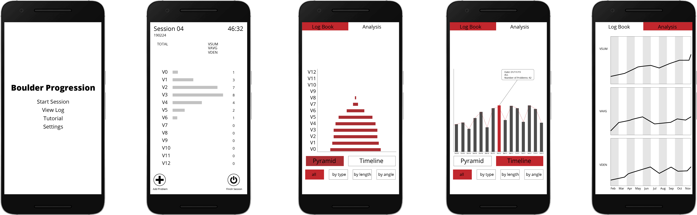

# Boulder Progression
## Introduction
Boulder Progression is an app for my personal climbing training use. Based on the non-linear framework outlined by Steve Bechtel in his book _Logical Progression_, Boulder Progression quantifies climbing training (more specifically, bouldering training) which, as any climber knows, is an exceptionally difficult task compared to other sports. To progress in any sport, the basic principle of progressive overload and balanced recovery applies. Boulder Progression seeks to make climbing training quantifiable and, thus, measurable to achieve these principles by focusing on a few key metrics:
* Grade Sum (VSum): An indicator of work volume (e.g. V2+V2+V2+V3+V3+V4+V5 = V21). V0 is counted as 1. Focus on this when training for __work capacity or all-day endurance__.
* Average Grade (VAvg): An indicator of intensity. VSum divided by number of problems (e.g. V21/7 = V3). For the same VSum, if the VAvg is higher, it means the session was more intense in terms of effort. Focuson on this when training for __strength & power__.
* Session Density (VDen): Vsum / session length. Focus on this for training __power endurance__.
* In each climbing session, the focus is on pushing one of the metrics, so they increase over time and, hence, provide a measurable outcome of your training plan and give an indication whether you are achieving the objectives of your current training block/season. 

## Mockup

## Features
* UI optimized for data recording during a training session. 
  *   Clear display of real-time stats (session duration, VSum/VAvg/VDen) to adjust intensity of your session on the fly.
  *   graphic visualization of your session pyramid
* Summary and analysis of your tracked sessions with data visualization to gauge your progress in your training block. 
* 
## Development
Development is currently on hold, as all climbing gyms are closed due to the pandemic, so I have no way to test it in a real-world setting. Will be resumed once things normalize.
### To Do:
* CSV export
* Outdoor sessions
* Additional differentiation per problem (Type, Angle, Length)

## Technologies
* __SQLite__ for storing session data
* __MPAndroidChart__ for data visualization

## Setup
I am considering to publish it on Google Play Store eventually if there is any interest.. Otherwise, download repo and compile in Android Studio.

